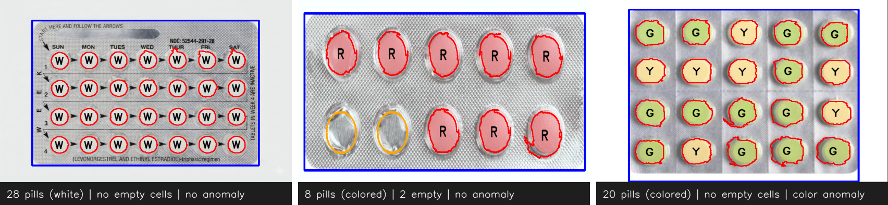

# Pill Blister Classifier

A computer vision system that inspects photos of pill blister packs with **classical image processing** (OpenCV, no machine learning). For each pack it:

- **Counts the pills** and labels each one with its color (`W` white, `R` red, `Y` yellow, `G` green, `B` blue…)
- **Detects empty blister cells** where a pill is missing
- **Flags color anomalies**, when a pill doesn't match the rest of the pack

It runs two ways: a **desktop app** that shows every processing step, and a **Raspberry Pi 5** version that signals the inspection result with LEDs and a servo motor.



## Two versions

| | Desktop (`pill_classifier.py`) | Raspberry Pi 5 (`pill_classifier_RPi5.py`) |
|---|---|---|
| Interface | Tkinter window with debug panels for each pipeline step | Headless, results printed over SSH |
| Input | Images in `images/` or a file you open | Images in `images/` |
| Output | Annotated images, pill count, status lights | Red / blue / green LEDs and a servo angle |
| Hardware | Any PC | Pi 5, 3 LEDs, SG90 servo |

Both versions run the same detection pipeline and produce identical results on the included test images.

## How the pipeline works

1. **Rectify the pack**: find the pack's outline and apply a perspective warp so it looks photographed from directly above.
2. **White balance**: use the silver foil as a neutral reference to remove the lighting's color cast.
3. **Find the blister area**: detect the region that holds the pills.
4. **Classify the pills as white or colored**, which decides the segmentation strategy:
   - **White pills**: Otsu brightness threshold inside the blister area, morphological cleanup and hole filling, then distance transform + **watershed** to split touching pills.
   - **Colored pills**: CLAHE contrast enhancement combined with adaptive thresholding, saturation and darkness masks.
5. **Filter contours** by area, circularity/solidity and size relative to the median pill.
6. **Label colors**: map each pill's average hue to a color name.
7. **Detect empty cells**: infer the pack's grid from the detected pill positions, extrapolate the missing grid positions and confirm each one looks like empty foil.
8. **Detect color anomalies**: compare pills by saturation and hue; a pill that stands out flags the pack.

A detailed walkthrough of every step, with the functions involved, is in [docs/how-it-works.md](docs/how-it-works.md).

## Getting started (desktop)

Requires **Python 3.9+** (Tkinter is included with Python on Windows and macOS).

```bash
pip install -r requirements.txt
python pill_classifier.py                 # browse all images in images/
python pill_classifier.py path/to/pack.jpg
```

Use **Previous / Next** to cycle through the images and **Open Image** to load your own. The two lights in the top bar turn red when empty cells or a color anomaly are found.

## Raspberry Pi 5

```bash
pip install -r requirements-rpi.txt
python3 pill_classifier_RPi5.py                         # dry run, prints what the GPIO would do
python3 pill_classifier_RPi5.py --use-gpio --wait-key   # real LEDs and servo, Enter for next image
python3 pill_classifier_RPi5.py --use-gpio --loop-delay 3
```

| Inspection result | Red LED (GPIO 17) | Blue LED (GPIO 27) | Green LED (GPIO 22) | Servo (GPIO 12) |
|---|---|---|---|---|
| All good | off | off | **on** | 90° |
| Empty cells | **on** | off | off | 180° |
| Color anomaly | off | **on** | off | 135° |
| Both | **on** | **on** | off | 0° |

The full setup (flashing the SD card, SSH, wiring diagram, hardware tests and troubleshooting) is in [docs/raspberry-pi-setup.md](docs/raspberry-pi-setup.md).

## Project structure

```
├── pill_classifier.py        # Desktop app: pipeline + Tkinter debug UI
├── pill_classifier_RPi5.py   # Raspberry Pi 5: pipeline + GPIO (LEDs, servo)
├── images/                   # Test blister pack photos
├── docs/
│   ├── how-it-works.md       # Step-by-step pipeline explanation
│   ├── raspberry-pi-setup.md # Pi setup, wiring and demo guide
│   └── results.png
├── requirements.txt
└── requirements-rpi.txt
```

## License

[MIT](LICENSE)
